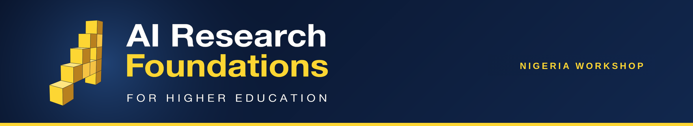

# AIMS AI Research Foundations - Nigeria Workshop 2

Materials for the second Nigeria lecturer workshop (Cohort 2) of the **Africa AI Upskilling Programme** — AI Research Foundations for Higher Education.

## 🎓 About

The second Nigeria week continues the continental rollout of the AI Research Foundations lecturer training: Google DeepMind's curriculum, UCL's lecturer toolkit, and AIMS training and mentoring the lecturers — with FATE Foundation as the local partner.

📅 **Dates:** 17 – 21 August 2026
📍 **Venue:** Lagos, Nigeria (UNILAG Unipod) · hosted with FATE Foundation
👥 **Audience:** AI Champions — university lecturers and teaching assistants

## 🚀 What You Will Do

- 🧠 **Learn** - Build a strong foundation in machine learning, neural networks, natural language processing, and large language models through lectures and hands-on labs.
- 👨‍🏫 **Teach** - Develop practical teaching and facilitation skills using the curriculum, and practise explaining technical concepts through peer teaching and structured feedback.
- 🌍 **Adapt** - Contextualise course materials for different student backgrounds and local African contexts, and contribute feedback to improve the workshop for future cohorts.
- 🤝 **Connect** - Collaborate with peers across the African AI community and build a network that supports your teaching beyond the workshop.

## Structure

One folder per session on the timetable, in the rough order of the week:

- [`technical-lectures/`](technical-lectures/) - The day's core AI content, one AIRF course per day (C2, C3, C4, C5, C7).
- [`pedagogy-ai-vs-ri/`](pedagogy-ai-vs-ri/) - Introduce Pedagogical Concept + AI vs RI Activities (Mon).
- [`toolkit-walkthroughs/`](toolkit-walkthroughs/) - UCL-toolkit AI + RI activities, worked through as you'd teach them.
- [`explain-it-back/`](explain-it-back/) - Peer-teaching practice with concept cards.
- [`lecture-it-back/`](lecture-it-back/) - Groups deliver a toolkit activity to the room (planning Tue, deliveries Thu-Fri).
- [`gcsb-onboarding/`](gcsb-onboarding/) - Google Cloud Skills Boost account setup (Tue).
- [`contextualize-for-africa/`](contextualize-for-africa/) - Adapting the materials to local contexts (Tue).
- [`agentic-ai-hands-on/`](agentic-ai-hands-on/) - Hands-on agentic AI session (Wed).
- [`challenge-lab-walkthrough/`](challenge-lab-walkthrough/) - GSP531 challenge-lab debrief (Wed).
- [`capstone/`](capstone/) - Capstone Project Workshop sessions (Wed + Thu).
- [`course-labs/`](course-labs/) - End-of-day Course Lab notebooks.
- `docs/` · `references/` - Course learning objectives, cheatsheets/glossary/reading list.

Each session's slide deck is committed **inside its own folder** once frozen on Drive. The social openers, Workshop Overview and Closing Remarks are Drive-managed and have no folder, as do structural items (registration, breaks, lunch) — see the schedule below.

## 🧪 Today's lab, one click away

The Day 1 (Course 2) lab notebook is committed — open it straight in Colab from [`course-labs/`](course-labs/). The remaining Course Lab notebooks and their **Open in Colab** badges appear there as the Cohort 2 copies are frozen.

## Where materials live

- Notebooks, code, and exercises. Versioned, Colab-ready, and forkable for each cohort. Frozen slide decks are committed inside each session's folder.

## Schedule

Five days blending technical lectures, hands-on sessions, peer teaching, and social activities. Times are in West Africa Time (WAT).

<strong>Day 1 - Monday, 17 August 2026</strong>

| Time | Session |
|------|---------|
| 09:30-10:00 | Registration & Welcoming |
| 10:00-10:30 | AI Trainer Bingo |
| 10:30-11:00 | Workshop Overview |
| 11:00-12:00 | Course 2 Technical Lecture |
| 12:00-12:30 | Break |
| 12:30-13:00 | Introduce Pedagogical Concept |
| 13:00-13:30 | AI vs RI Activities |
| 13:30-14:30 | Lunch |
| 14:30-15:30 | Toolkit Activity Walkthrough |
| 15:30-16:00 | Break |
| 16:00-17:00 | Explain It Back |
| 17:00-18:00 | Course 2 Lab |

<strong>Day 2 - Tuesday, 18 August 2026</strong>

| Time | Session |
|------|---------|
| 09:00-09:30 | Social - Africa Quiz |
| 09:30-11:00 | Course 3 Technical Lecture |
| 11:00-12:00 | Toolkit Activity Walkthrough |
| 12:00-12:30 | Break |
| 12:30-13:30 | Explain It Back |
| 13:30-14:30 | Lunch |
| 14:30-15:00 | Lecture it Back Planning |
| 15:00-15:30 | GCSB Onboarding |
| 15:30-16:00 | Break |
| 16:00-17:00 | Contextualize for Africa |
| 17:00-18:00 | Course 3 Lab |

<strong>Day 3 - Wednesday, 19 August 2026</strong>

| Time | Session |
|------|---------|
| 09:00-09:30 | Social - Spot the Slop |
| 09:30-11:00 | Course 4 Technical Lecture |
| 11:00-12:00 | Toolkit Activity Walkthrough |
| 12:00-12:30 | Break |
| 12:30-13:30 | Explain It Back |
| 13:30-14:30 | Lunch |
| 14:30-15:30 | Agentic AI Hands-on |
| 15:30-16:00 | Break |
| 16:00-16:30 | Challenge Lab Walkthrough |
| 16:30-17:00 | Capstone Project Workshop |
| 17:00-18:00 | Course 4 Lab |

<strong>Day 4 - Thursday, 20 August 2026</strong>

| Time | Session |
|------|---------|
| 09:00-09:30 | Social - Conversation Cards |
| 09:30-11:00 | Course 5 Technical Lecture |
| 11:00-12:00 | Toolkit Activity Walkthrough |
| 12:00-12:30 | Break |
| 12:30-13:30 | Explain It Back |
| 13:30-14:30 | Lunch |
| 14:30-15:30 | Capstone Project Workshop |
| 15:30-16:00 | Break |
| 16:00-17:00 | Lecture it Back |
| 17:00-18:00 | Course 5 Lab |

<strong>Day 5 - Friday, 21 August 2026</strong>

| Time | Session |
|------|---------|
| 09:00-09:30 | Social - What Would You Do? |
| 09:30-11:00 | Course 7 Technical Lecture |
| 11:00-12:00 | Toolkit Activity Walkthrough |
| 12:00-12:30 | Break |
| 12:30-13:30 | Explain It Back |
| 13:30-14:30 | Lunch |
| 14:30-15:30 | Course 7 Lab |
| 15:30-16:00 | Break |
| 16:00-17:00 | Lecture it Back |
| 17:00-17:30 | Closing Remarks |

